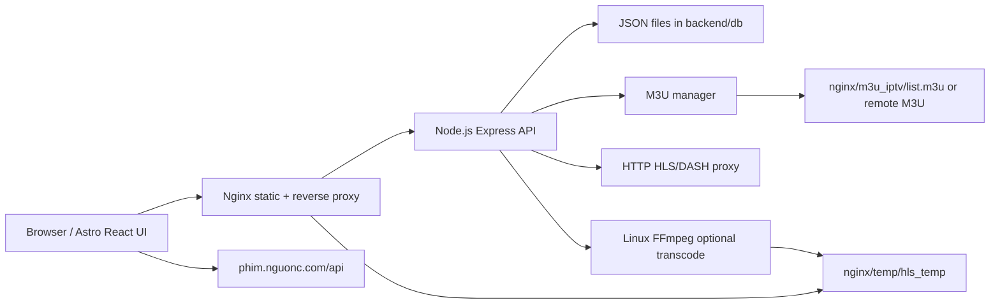

# Architecture

Frontend:

- Astro 6 with React islands.
- Tailwind via `@tailwindcss/vite`.
- Video.js for HLS/M3U8 playback.
- JW Player embed loader based on KratosRepo/drm-player for MPD/ClearKey streams already supplied by authorized sources.

Backend:

- Node.js / Express API.
- Socket.IO metrics and viewer counts.
- JSON-file persistence for events, users, comments, M3U sources, and IPTV settings.
- Axios streaming proxy with keep-alive agents and playlist URL rewriting.

Streaming:

- Default direct mode returns proxied source manifests to reduce CPU/RAM on a 2 vCPU / 1 GB VPS.
- FFmpeg mode remains available for HLS output when `directMode` is disabled.
- Nginx serves built frontend, proxies API/WebSocket traffic, and serves HLS/event temp files.
